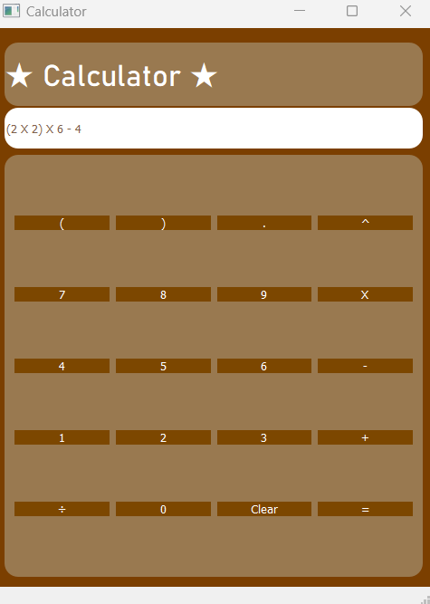

# Simple-calculator-app
Simple calculator app made with PyQt5

## About 
This application is a simple calculator app made with PyQt5, this calculator was made as a simple experimental project to learn GUI programming with PyQt5. The calculator can solve simple arithmetic problems and can detect whether an equation is incorrect and won't evaluate. 



## How to set up

In order to set up this you will need to install PyQT5 using pip, in order to do this for windows in the command line type the following code:

```
pip install pyqt5
```

For other operating systems search online for the package installation instructions. You will also need python installed and running, you might need to add python to PATH in order to install PyQt5.

[Link to finding out how to add python to PATH](https://www.educative.io/answers/how-to-add-python-to-path-variable-in-windows)

### Setting up after installing packages 

To set up after installing packages you need to download the two packages from this repository which are: 

* Calculator.py
* UI_calculator.ui

Once installed place them in a folder and in that folder open the python file and edit with idle in order to change: the line at the top of the file that says 

```python
Ui_MainWindow, QtBaseClass = uic.loadUiType(r"ENTER YOUR FILEPATH HERE")
```

Upon saving and running the file provided you have set up the packages needed the program should work.


